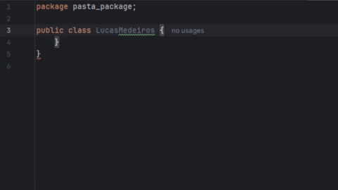

## 👋 Seja bem-vindo Excelentíssimo(a) Visitante!


### <center></center>

### 👾 const aboutMe = ( ) => {

```ruby
Atualmente estou na minha segunda graduação em Engenharia de Software e cursando Pós-graduação
em Desenvolvimento Orientado a Objetos com Java, sempre buscando melhorar arquitetura,
boas práticas e qualidade de código.

Sou bacharel em Engenharia Civil e atuei ao longo de 5 anos na área, principalmente com gestão,
planejamento, gerenciamento e fiscalização de obras de alto padrão.

```
<!-- Coloque suas informações pessoais que você deseja compartilhar -->
 
### };

---

### 👨‍💻 interface CurrentStack {

#### Atual (uso frequente em projetos):


#### Explorando / em desenvolvimento:


### } 

---

### 🔍 Onde me encontrar

[](https://med3ir0s.vercel.app/)
[](https://github.com/LMed3ir0s/)
[](https://www.linkedin.com/in/lucas-medeiros-ramos-1573741bb/)


---
