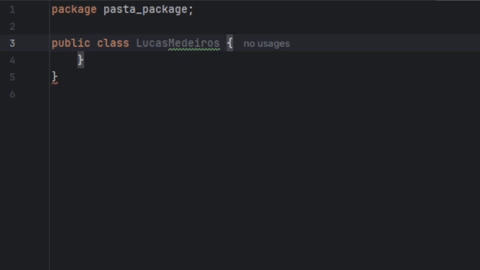

## 👋 Seja bem-vindo Excelentíssimo(a) Visitante!

<!-- <center></center> -->

### 👾 const aboutMe = ( ) => {

```ruby

Desenvolvedor Backend especializado em APIs escaláveis, microsserviços, automação e engenharia de dados.

Pós-graduado em Desenvolvimento Orientado a Objetos com Java e atualmente cursando minha segunda graduação em Engenharia de Software.

Possuo sólida experiência em arquitetura de sistemas, padrões de projeto e boas práticas de desenvolvimento, com foco na construção de soluções distribuídas, resilientes e de alta performance.

Minha trajetória anterior na Engenharia Civil contribuiu para desenvolver capacidade analítica, visão sistêmica e resolução estruturada de problemas, habilidades que hoje aplico diretamente no desenvolvimento de software.

Atuo no planejamento e implementação de APIs, pipelines ETL, mensageria assíncrona, integrações entre sistemas e aplicações distribuídas, incluindo deploy e containerização de ambientes cloud. Possuo experiência complementar com frontend, mobile, testes automatizados e arquitetura orientada a serviços.

```
<!-- Coloque suas informações pessoais que você deseja compartilhar -->
 
### };

##

### 👨‍💻 interface CurrentStack {

```ruby
#### Atual (uso frequente em projetos)

**Backend:** TypeScript, Node.js, NestJS, Java (Spring), Python (FastAPI, Django), Go, JWT  
**Bancos de dados:** PostgreSQL, MongoDB  
**Infra:** Docker, Docker Compose
**Frontend:** React, TailwindCSS, HTML5, CSS3  
**Mobile:** Flutter, React Native
**Cloud (AWS):** EC2, VPC, Route 53, S3, ECS, CloudWatch, IAM, CloudFront, WAF 

#### Explorando / em desenvolvimento

**APIs & Graph:** GraphQL, Apollo Server
**Outros:** Stripe, Ollama/Llama.cpp
```

}

### 📂 const data.projects = [ ... ]

👉 **[Veja todos os projetos](https://github.com/LMed3ir0s/Projects)**

##

### 🔍 Onde me encontrar

[](https://med3ir0s.vercel.app/)
[](https://github.com/LMed3ir0s/)
[](https://www.linkedin.com/in/lucas-medeiros-ramos-1573741bb/)

